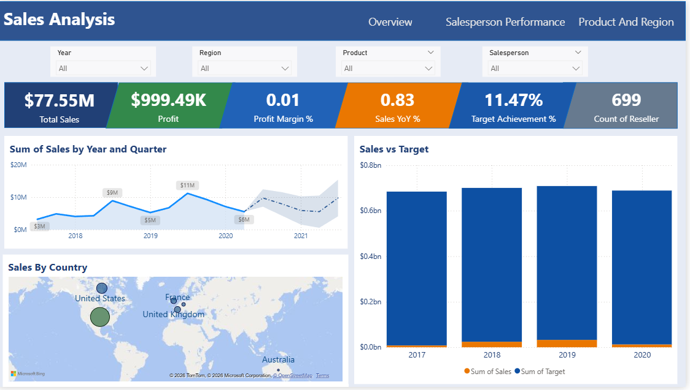
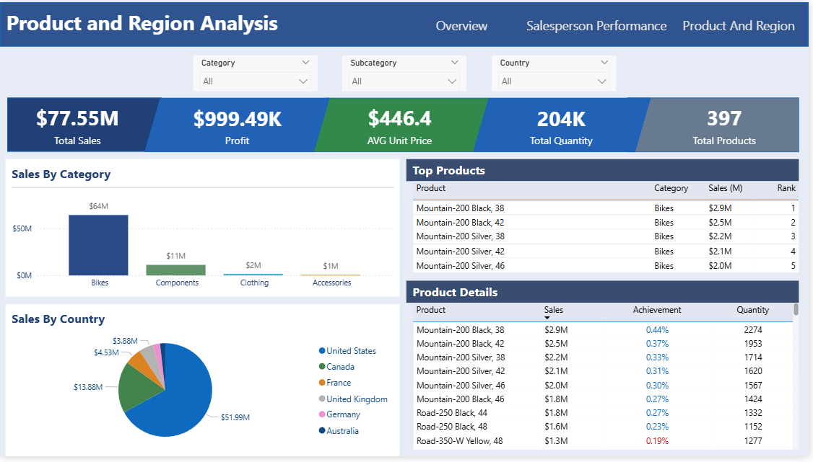

# powerbi-sales-dashboard

# 📊 Sales Performance Dashboard (Power BI)

## 🧩 Business Problem

Companies struggle to track sales performance across regions, products, and time.
This dashboard helps stakeholders quickly identify trends, top-performing products, and revenue drivers.

---

## 📁 Dataset Description

* Source: Sample sales dataset
* Rows: ~58,000
* Columns:
* Sales Table: SalesOrderNumber, OrderDate,	ProductKey,	ResellerKey,	EmployeeKey,	SalesTerritoryKey,	Quantity,	Unit Price,	Sales	Cost
* Products Table: ProductKey,	Product,	Standard Cost,	Color,	Subcategory,	Category,	Background Color, Format,	Font, Color Format
* Regions Table: SalesTerritoryKey,	Region,	Country,	Group
* Reseller Table: ResellerKey,	Business Type,	Reseller,	City,	State-Province,	Country-Region
* Salesperson Table: EmployeeKey,	EmployeeID,	Salesperson,	Title,	UPN
* SalespersonRegion Table: EmployeeKey,	SalesTerritoryKey
* Targets Table: EmployeeID,	Target,	TargetMonth

---

## 🛠 Tools Used

* Power BI (Data modeling & visualization)
* Excel / CSV (Data source)
* DAX (Measures & KPIs)

---

## 📊 Dashboard Features

* Revenue & Profit KPIs
* Year-over-Year Growth
* Sales by Region
* Top Products Analysis
* Dynamic filtering (Slicers)
* Dynamic Title
* Drill-down capabilities
* Forecast
* Tooltips
  

---

## 📈 Key Insights

* 📌 United States generates the highest revenue and Profit
* 📌 Bikes has consistent growth across all quarters
* 📌 Sales peak during Q3 due to seasonal demand

---

## 🖼 Dashboard Preview

### Executive Overview

### Sales Analysis

### Product Insights

---

## ▶️ How to Use

1. Download the `.pbix` file from `/pbix`
2. Open in Power BI Desktop
3. Interact with slicers and visuals

---

## 🔒 Data Notes

This project uses **synthetic / publicly available data**.
No sensitive or confidential data is included.

---

## 📌 Conclusion

This dashboard enables faster, data-driven decision-making by providing a clear view of sales performance and trends.

---

## ⭐ Ziyoda

Your Name
Aspiring Data Analyst
